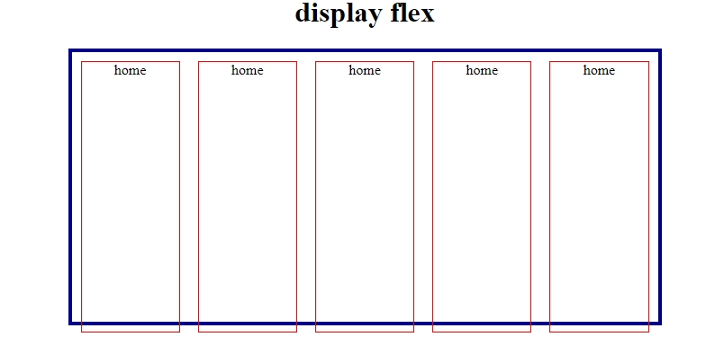
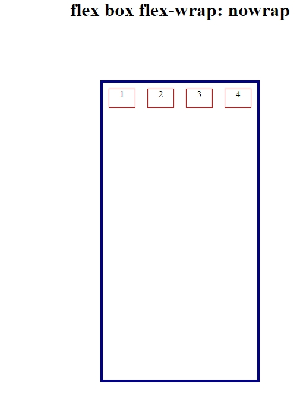
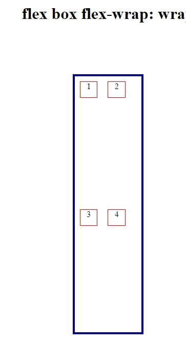
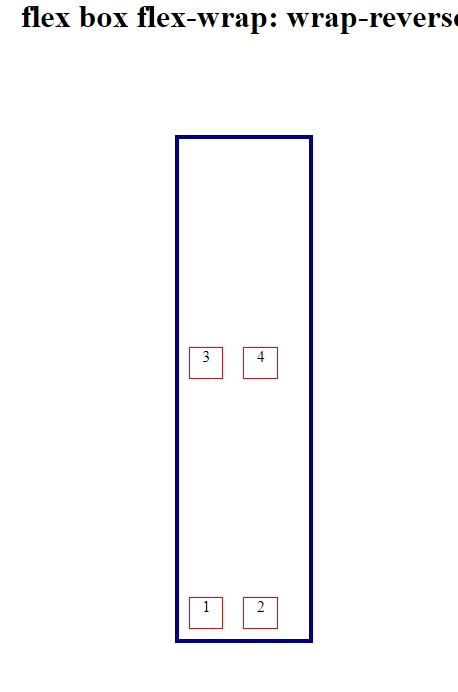

 # POC1-Flexbox
Prova de conceito sobre as propriedades Flexbox.

 

  

<h1 align="center">POC - Flexbox</h3>

  

  O objetivo desta prova de conceito é ajudar os usuários a entender e aplicar HTML e CSS, com foco específico em Flexbox, proporcionando uma base sólida para a criação de layouts responsivos e flexíveis.
  

<!-- TABLE OF CONTENTS -->

  
Table of Contents

  <ol>
    <li>
      <a href="#about-the-project">About The Project</a>
      <ul>
        <li><a href="#built-with">Built With</a></li>
      </ul>
    </li>
    <li>
      <ul>
        <li><a href="#prerequisites">Prerequisitos</a></li>
      </ul>
    </li>
    <li><a href="#usage">Uso</a></li>
    <li><a href="#roadmap">Roadmap</a></li>
    <li><a href="#contact">Contatot</a></li>
  </ol>

<!-- ABOUT THE PROJECT -->
## Sobre o Projeto

[![Product Name Screen Shot][product-screenshot]](https://example.com)

Este projeto é parte do segundo semestre do curso de Sistemas de Informação do Mackenzie, na disciplina de Web Mobile. Trata-se da primeira prova de conceito, com uma abordagem extensiva que visa ampliar o conhecimento na área e promover um impacto positivo na comunidade. O objetivo é ajudar os usuários a entender e aplicar HTML e CSS, com foco específico em Flexbox, proporcionando uma base sólida para a criação de layouts responsivos e flexíveis.

(<a href="#readme-top">back to top</a>)

### Construído com

* HTML5
* CSS

(<a href="#readme-top">back to top</a>)

### Prerequisitos para começar a usar flexbox

1. Conhecimento Basico de HTML e CSS
HTML: Entendimento de como estruturar documentos HTML com elementos e atributos.
CSS: Compreensao de como aplicar estilos aos elementos HTML, incluindo seletores, propriedades e valores.

2. Conceitos Fundamentais de Layout
Modelo de Caixa (Box Model): Saber como as propriedades width, height, padding, border e margin afetam o layout dos elementos.
Posicionamento: Entender as propriedades de posicionamento como static, relative, absolute e fixed.

3. Propriedades CSS Basicas
Display: Conhecimento das propriedades display, como block, inline, inline-block, e none.
Margin e Padding: Compreensao de como as margens e o preenchimento afetam o espaco ao redor e dentro dos elementos.

4. Conhecimento de Layouts Basicos
Layouts de Bloco e Inline: Saber como os elementos de bloco e inline se comportam e como eles sao exibidos em relacao ao fluxo do documento.

5. Navegadores e Ferramentas de Desenvolvimento
Compatibilidade de Navegadores: Saber que Flexbox e amplamente suportado pelos navegadores modernos, mas pode ter algumas diferencas de implementacao.
Ferramentas de Desenvolvimento: Usar ferramentas de desenvolvimento do navegador para inspecionar e depurar layouts flexiveis.

(<a href="#readme-top">back to top</a>)

<!-- USAGE EXAMPLES -->
## Uso

 Flexbox pode ser usado para criar um layout basico onde os itens sao distribuídos uniformemente ao longo do contêiner.

1. Alinhamento Horizontal

  Alinhe itens horizontalmente ao longo do eixo principal com diferentes opcoes de alinhamento, como centralizado, ao inicio ou ao final.

2. Alinhamento Vertical

Alinhe itens verticalmente ao longo do eixo transversal, ajustando a posicao dos itens em relacao ao contêiner.
Layout em Colunas e Linhas

3. Use a propriedade flex-direction para alternar entre layouts em coluna e linha, permitindo organizar os itens    verticalmente ou horizontalmente.

4. Embutir Layouts Flexiveis

  Utilize Flexbox dentro de outros contêineres flexiveis para criar layouts mais complexos e responsivos.

(<a href="#readme-top">back to top</a>)

<!-- ROADMAP -->
## Roadmap

- [ ] **Crie um layout basico onde os itens sao distribuídos uniformemente ao longo do contêiner.**  
  *Veja: `display: flex;`*
   

- [ ] **Alinhe itens horizontalmente ao longo do eixo principal com diferentes opcoes de alinhamento, como centralizado(center), ao inicio (start) ou ao final (end).**  
  *Veja: `justify-content: center;`, `justify-content: start;`, `justify-content: end;`*
  
  
  

- [ ] **Alinhe itens verticalmente ao longo do eixo transversal, ajustando a posicao dos itens em relacao ao contêiner no centro (center), ao inicio (start) ou ao final (end)**  
  *Veja: `align-items: center;`, `align-items: start;`, `align-items: end;`*
  
  
  

- [ ] **Use a propriedade `flex-direction` para alternar entre layouts em coluna e linha, permitindo organizar os itens verticalmente ou horizontalmente e de forma inversa.**  
  *Veja: `flex-direction: row;`, `flex-direction: row-reverse;`, `flex-direction: column;`, `flex-direction: column-reverse;`*
  
  
  
  

- [ ] **Utilize Flexbox dentro de outros contêineres flexiveis para criar layouts mais complexos e responsivos.**  
  *Veja: `flex-wrap: nowrap;`, `flex-wrap: wrap;`, `flex-wrap: wrap-reverse;`*
   - Os itens flexíveis permanecem em uma única linha, sem quebra. Isso pode resultar em overflow se o conteúdo exceder o espaço disponível. 
   - Os itens flexíveis quebram em várias linhas, se necessário, para se ajustarem ao contêiner. As linhas adicionais são dispostas abaixo da linha anterior.
   - Os itens flexíveis também quebram em várias linhas, mas as linhas adicionais são dispostas acima da linha anterior, invertendo a ordem padrão de empilhamento.

- [ ] **Crie layouts flexiveis com diferentes opcoes de justificacao e alinhamento.**  
  *Veja: `justify-content: space-around;`, `justify-content: space-between;`*
  - Distribui os itens de forma que o espaço restante é dividido igualmente entre eles, colocando o primeiro item no início e o último no final da linha.
   - Distribui os itens de forma que o espaço restante é dividido igualmente entre eles, colocando o primeiro item no início e o último no final da linha.

(<a href="#readme-top">back to top</a>)

